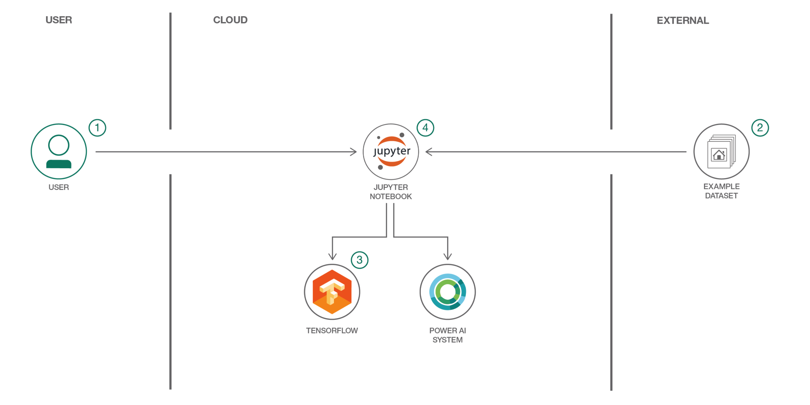

<a href="https://www.cognitiveclass.ai"></a>
<br>
<br>

# Search for extra terrestrial intelligence (SETI) with Tensorflow on PowerAI

Each night, using the Allen Telescope Array (ATA) in northern California, the SETI Institute scans the sky at various radio frequencies, observing star systems with known exoplanets, searching for faint but persistent signals. The current signal detection system is programmed to search only for particular kinds of signals: narrow-band carrier waves. However, the detection system sometimes triggers on signals that are not narrow-band signals (with unknown efficiency) and are also not explicitly-known radio frequency interference (RFI). There seems to be various categories of these kinds of events that have been observed in the past.

Our goal is to classify these accurately in real-time. This may allow the signal detection system to make better observational decisions, increase the efficiency of the nightly scans, and allow for explicit detection of these other signal types.

For more information refer to [SETI hackathon page](https://github.com/setiQuest/ML4SETI/).

When you’ve completed this pattern, you will understand how to:

- Convert signal data into image data
- Build and train a convolutional neural network
- Display and share results in Jupyter Notebooks

This pattern will assist application developers who need to efficiently build powerful deep learning applications and use GPUs to train the model quickly.

<!-- TODO:


## Flow

1. The developer loads the provided notebook, which is run on a PowerAI system.
2. A provided example dataset demonstrates a use case of recognizing images of houses with pools vs. houses without pools.
3. The notebook uses the TensorFlow Inception model and retraining example to leverage the existing model and build a custom classifier.
4. The notebook compares results using the original model and the new model.
 -->

<!-- TODO:
# Watch the Video

[](https://www.youtube.com/watch?v=S3jdmKrERrE)
 -->

# Steps

Follow these steps to setup and run this code pattern. The steps are
described in detail below.

1. [Get 24-hours of free access to the PowerAI platform](#1-get-24-hours-of-free-access-to-the-powerai-platform)
1. [Access and start the Jupyter notebooks](#2-access-and-start-the-jupyter-notebooks)
1. [Run the notebooks](#3-run-the-notebooks)
1. [Analyze the results](#4-analyze-the-results)
1. [Save and share](#5-save-and-share)
1. [End your trial](#6-end-your-trial)

## 1. Get 24-hours of free access to the PowerAI platform

IBM has partnered with Nimbix to provide cognitive developers a trial account that provides 24-hours of free processing time on the PowerAI platform. Follow these steps to register for access to Nimbix to try the PowerAI code patterns and explore the platform.

* Go [here](https://www.ibm.com/account/reg/us-en/login?formid=urx-19543) and follow the instructions to register for your free trial.

* Use the welcome page (or confirmation email) to determine when your container is "ACTIVE" and collect the following information:
  * **IP Address** (might be fully qualified domain name)
  * **User Id**
  * **Password**

* Take the **IP Address** (FQDN) and use your local browser to go to `https://<IP Address>`.

* Login with the **User Id** and **Password**.

  

## 2. Access and start the Jupyter notebooks

* Get a new terminal window by clicking on the ```New``` pull-down and selecting ``Terminal``.

  

* When using the free trial, a 4-hour timeout will cause you to lose data that is not in the `/data` directory. Create a `patterns` directory under `/data` and a symbolic link for that directory under `/usr/local/samples/` as follows:

  ```commandline
  mkdir /data/patterns
  ln -s /data/patterns /usr/local/samples/patterns
  ```

* Use `git clone` to download the example notebook, dataset, and retraining library into `/data/patterns`:

  ```commandline
  cd /data/patterns
  git clone https://github.com/IBM/powerai-seti-signal-classification
  ```

  

* Once done, you can exit the terminal and return to the notebook browser. Use the `Files` tab. From the root folder, click on `patterns`, `powerai-seti-signal-classification`, and then `notebooks`.

  

<!-- TODO: the notebook list to open
, and then `Classifying-House-And-Pool-Images.ipynb` to open the notebook.
-->


* If your container is paused (after 4 hours) and you resume it, your data will still be under `/data`. Recreate the symbolic link for it to show up in the Jupyter files tree.

  ```commandline
  ln -s /data/patterns /usr/local/samples/patterns
  ```
## 3. Run the notebooks

## Notebooks:
This repository includes 3 parts:
### 1. Preparing dataset
  * **Converting images to binary files using Numpy (SETI_img_to-binary.ipynb)**
      <!-- TODO: has errors in the output -->
      * In this notebook we read the Basic 4 dataset and convert signals into a binary file. Also, we split data into train/test datasets. 
  * **Optional: Converting images to binary files using Spark (SETI_img_to_binary_spark.ipynb)**  
      <!-- TODO: requires object storage setup -->
      * In this notebook we read the Basic 4 dataset through Spark, and convert signals into a binary file. It is an optional notebook and you don't have to run it if you have already converted the images to binary files.
### 2. Classification
 * **Classification of images using CCN on Single GPU (SETI_CNN_Tf_SingleGpu.ipynb)**
     * In this Notebook, we will use the famous [SETI Dataset](https://github.com/setiQuest/ML4SETI/) to build a Convolutional Neural Networks capable to perform signals classification. CNN will say, with some associated error, what type of signal is the presented input.
     * In our case, as we are running this notebook on [IBM PowerAI](http://cocl.us/SETI-NIMBIX-PowerAI), you hvae access to multi GPU, but we use one of the GPUs in this notebook, for the sake of simplicity.
 * **Optional: Classification of images using CCN on Multi GPU (SETI_CNN_Tf_MultiGpu.ipynb)** 
     * This Notebook, builds a Convolutional Neural Networks, but using multi GPUs. You will use IBM PowerAI with multiple GPU to train the model in parallel manner.
     * You can run this notebook in case you have access to an environment with multiple GPUs.
### 3. Prediction
* **Use the trained model for prediciton (SETI_prediction.ipynb)**
     * In this notebook you can load a pre-trained model and predict the signal class.

### Running notebooks

When a notebook is executed, what is actually happening is that each code cell in
the notebook is executed, in order, from top to bottom.

Each code cell is selectable and is preceded by a tag in the left margin. The tag
format is `In [x]:`. Depending on the state of the notebook, the `x` can be:

* A blank, this indicates that the cell has never been executed.
* A number, this number represents the relative order this code step was executed.
* A `*`, this indicates that the cell is currently executing.

There are several ways to execute the code cells in your notebook:

* One cell at a time.
  * Select the cell, and then press the `Play` button in the toolbar.
* Batch mode, in sequential order.
  * From the `Cell` menu bar, there are several options available. For example, you
    can `Run All` cells in your notebook, or you can `Run All Below`, that will
    start executing from the first cell under the currently selected cell, and then
    continue executing all cells that follow.


### Performance
Convelutional Neural Network involves a lot of matrix and vector multiplications that can parallelized, so GPUs can overperform, because GPUs were designed to handle these kind of matrix operations in parallel!

### Why GPU overperforms?
A single core CPU takes a matrix operation in serial, one element at a time. But, a single GPU could have hundreds or thousands of cores, while a CPU typically has no more than a few cores.


### How to use GPU with TensorFlow?
It is important to notice that if both CPU and GPU are available on the machine that you are running the noebook, and if a TensorFlow operation has both CPU and GPU implementations, the GPU devices will be given priority when the operation is assigned to a device. 


### Benchmark:
- SETI_single_gpu_train.py achieves ~72% accuracy after 3k epochs of data (75K steps).
- Speed: With batch_size 128.  
- __Notice:__ The model is not optimized to reach to its highest accuracy, you can achive better results tuning the parameters.

<table border="1" style="box-sizing: border-box; border-spacing: 30px; background-color: transparent; color: #333333; font-family: 'Helvetica Neue', Helvetica, Arial, sans-serif; font-size: 12px;">
<tbody style="box-sizing: border-box;">
<tr style="box-sizing: border-box;">
<td style="box-sizing: border-box; padding: 3px; text-align:left;"><span style="box-sizing: border-box; font-weight: bold;">CPU Architecture</span></td>
<td style="box-sizing: border-box; padding: 3px; text-align:left;"><span style="box-sizing: border-box; font-weight: bold;">CPU cores&nbsp;</span></td>
<td style="box-sizing: border-box; padding: 3px; text-align:left;"><span style="box-sizing: border-box; font-weight: bold;">Memory&nbsp;</span></td>
<td style="box-sizing: border-box; padding: 3px; text-align:left;"><span style="box-sizing: border-box; font-weight: bold;">GPU&nbsp;</span></td>
<td style="box-sizing: border-box; padding: 3px; text-align:left;"><span style="box-sizing: border-box; font-weight: bold;">Step time (sec/batch)&nbsp;</span></td>
<td style="box-sizing: border-box; padding: 3px; text-align:left;"><span style="box-sizing: border-box; font-weight: bold;">&nbsp;Accuracy</span></td>
</tr>
<tr style="box-sizing: border-box;">
<td style="box-sizing: border-box; padding: 3px; text-align:left;">POWER8</td>
<td style="box-sizing: border-box; padding: 3px; text-align:center;">40</td>
<td style="box-sizing: border-box; padding: 3px; text-align:center;">256 GB</td>
<td style="box-sizing: border-box; padding: 3px; text-align:left;">1 x Tesla K80</td>
<td style="box-sizing: border-box; padding: 3px; text-align:center;">~0.127 </td>
<td style="box-sizing: border-box; padding: 3px; text-align:left;">~72% at 75K steps  (3 hours)</td>
</tr>
<tr style="box-sizing: border-box;">
<td style="box-sizing: border-box; padding: 3px; text-align:left;" >POWER8</td>
<td style="box-sizing: border-box; padding: 3px; text-align:center;">32</td>
<td style="box-sizing: border-box; padding: 3px; text-align:center;">128 GB</td>
<td style="box-sizing: border-box; padding: 3px; text-align:left;">1 x Tesla P100 w/NVLink np8g4</td>
<td style="box-sizing: border-box; padding: 3px; text-align:center;">~0.035 </td>
<td style="box-sizing: border-box; padding: 3px; text-align:left;">~72% at 75K steps  (1 hour)</td>
</tr>


</tbody>
</table>


- SETI_multi_gpu_train.py achieves ~72% accuracy after 75K steps.
- Speed: With batch_size 128.  
- __Notice:__ The model is not optimized to reach to highest accuracy, and you can achive better results tuning the parameters.

<table border="1" style="box-sizing: border-box; border-spacing: 30px; background-color: transparent; color: #333333; font-family: 'Helvetica Neue', Helvetica, Arial, sans-serif; font-size: 12px;">
<tbody style="box-sizing: border-box;">
<tr style="box-sizing: border-box;">
<td style="box-sizing: border-box; padding: 3px; text-align:left;"><span style="box-sizing: border-box; font-weight: bold;">CPU Architecture</span></td>
<td style="box-sizing: border-box; padding: 3px; text-align:left;"><span style="box-sizing: border-box; font-weight: bold;">CPU cores&nbsp;</span></td>
<td style="box-sizing: border-box; padding: 3px; text-align:left;"><span style="box-sizing: border-box; font-weight: bold;">Memory&nbsp;</span></td>
<td style="box-sizing: border-box; padding: 3px; text-align:left;"><span style="box-sizing: border-box; font-weight: bold;">GPU&nbsp;</span></td>
<td style="box-sizing: border-box; padding: 3px; text-align:left;"><span style="box-sizing: border-box; font-weight: bold;">Step time (sec/batch)&nbsp;</span></td>
<td style="box-sizing: border-box; padding: 3px; text-align:left;"><span style="box-sizing: border-box; font-weight: bold;">&nbsp;Accuracy</span></td>
</tr>
<tr style="box-sizing: border-box;">
<td style="box-sizing: border-box; padding: 3px; text-align:left;">POWER8</td>
<td style="box-sizing: border-box; padding: 3px; text-align:center;">160</td>
<td style="box-sizing: border-box; padding: 3px; text-align:center;">1 TB</td>
<td style="box-sizing: border-box; padding: 3px; text-align:left;">4 x Tesla K80</td>
<td style="box-sizing: border-box; padding: 3px; text-align:center;">~0.066 </td>
<td style="box-sizing: border-box; padding: 3px; text-align:left;">~72% at 75K steps  (83 minutes)</td>
</tr>
<tr style="box-sizing: border-box;">
<td style="box-sizing: border-box; padding: 3px; text-align:left;" >POWER8</td>
<td style="box-sizing: border-box; padding: 3px; text-align:center;">64</td>
<td style="box-sizing: border-box; padding: 3px; text-align:center;">256 GB</td>
<td style="box-sizing: border-box; padding: 3px; text-align:left;">2 x Tesla P100 w/NVLink np8g4</td>
<td style="box-sizing: border-box; padding: 3px; text-align:center;">~0.033 </td>
<td style="box-sizing: border-box; padding: 3px; text-align:left;">~72% at 75K steps  (40 minutes) </td>
</tr>
<tr style="box-sizing: border-box;">
<td style="box-sizing: border-box; padding: 3px; text-align:left;">POWER8</td>
<td style="box-sizing: border-box; padding: 3px; text-align:center;">128</td>
<td style="box-sizing: border-box; padding: 3px; text-align:center;">512 GB</td>
<td style="box-sizing: border-box; padding: 3px; text-align:left;">4 x Tesla P100 w/NVLink np8g4</td>
<td style="box-sizing: border-box; padding: 3px; text-align:center;">~0.017 </td>
<td style="box-sizing: border-box; padding: 3px; text-align:left;">~72% at 75K steps  (20 minutes)</td>
</tr>
</tbody>
</table>

## 4. Analyze the results

When you run the "Main" code cell you can watch the training as the accuracy
quickly improves. At the end, the final test accuracy is shown. We usually see
somewhere around 85% accuracy with these images.


We captured the model before and after the training. Look at our example
images at the bottom of the notebook and see our before and after results.


The results should go from no recognition ability at all to a pretty good
success rate. You might find it interesting to try different images and see
if you can identify why it has more difficulty classifying some images.

## 5. Save and share

### How to save your work:

Because this notebook is running temporarily on a Nimbix
Cloud server, use the following options to save your work:

Under the `File` menu, there are options to:

* `Download as...` will download the notebook to your local system.
* `Print Preview` will allow you to print the current state of the
  notebook.

## 6. End your trial

When you are done with your work, please cancel your subscription by visiting the `Manage` link on the **My Products and Services** page.

<!-- TODO:
# Sample Output

You can see a copy of the notebook including output [here](examples/Classifying-House-And-Pool-Images.ipynb)
 -->